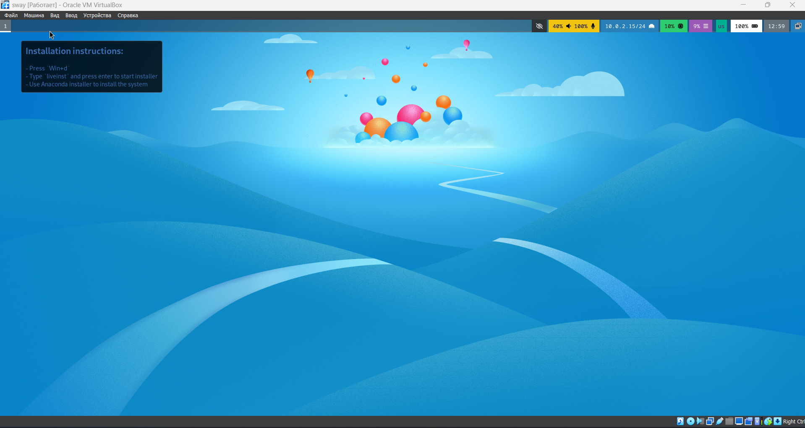
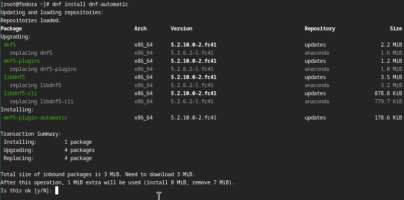
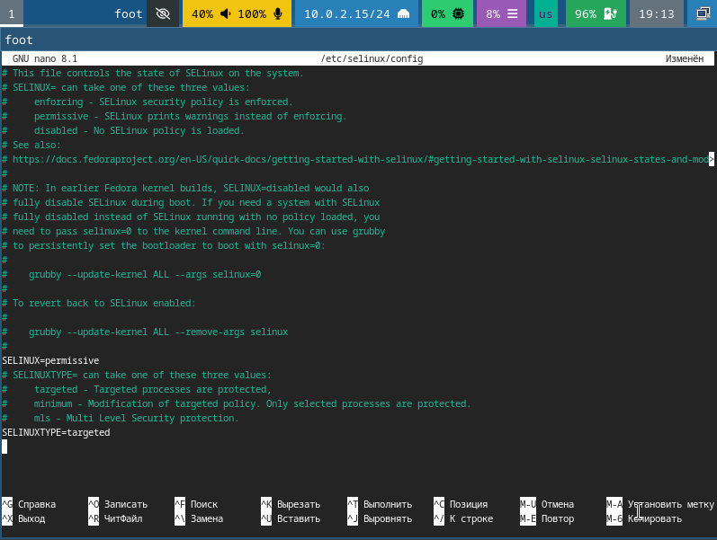
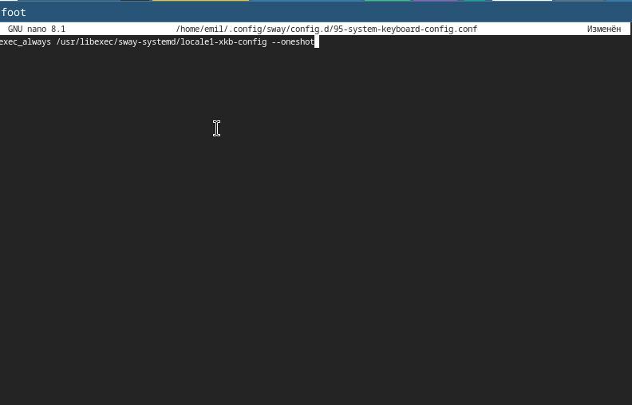
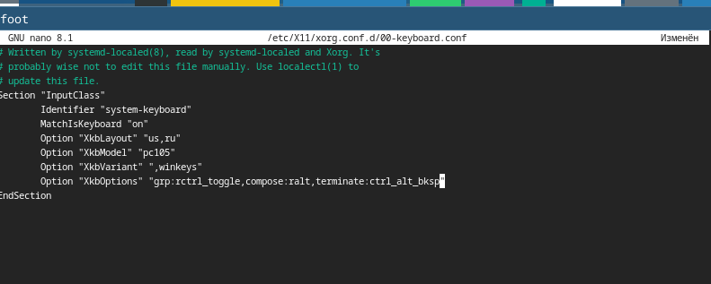
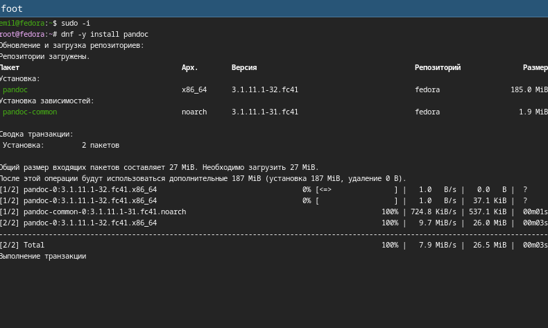
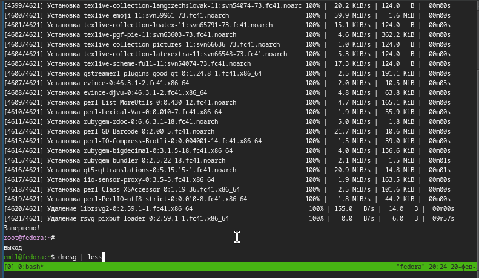
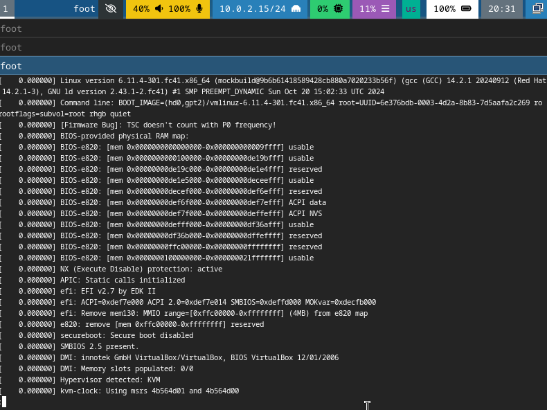

---
## Front matter
lang: ru-RU
title: Лабораторная работа №1
subtitle: Операционные сисетмы
author:
  - Ахатов Э. Э.
institute:
  - Российский университет дружбы народов, Москва, Россия
  - Объединённый институт ядерных исследований, Дубна, Россия
date: 01 января 1970

## i18n babel
babel-lang: russian
babel-otherlangs: english

## Formatting pdf
toc: false
toc-title: Содержание
slide_level: 2
aspectratio: 169
section-titles: true
theme: metropolis
header-includes:
 - \metroset{progressbar=frametitle,sectionpage=progressbar,numbering=fraction}
---

## Цель работы

Целью данной работы является приобретение практических навыков установки операционной системы на виртуальную машину, настройки минимально необходимых для дальнейшей работы сервисов.

## Задание

Установка виртуальной машины в virtualbox

## Создание виртуальной машины

Создаю машину

{ #fig:001 width=70% }

## Создание виртуальной машины

Запускаю машину

{ #fig:002 width=70% }

## Создание виртуальной машины

Устанавливаю машину на диск

{ #fig:004 width=70% }

## После установки

Устанавливаю средства разработки:

sudo dnf -y group install development-tools

Обновляю все пакеты

sudo dnf -y update

Программы для удобства работы в консоли:

sudo dnf -y install tmux mc

{ #fig:005 width=70% }

## После установки

Автоматическое обновление

Установка программного обеспечения:

sudo dnf -y install dnf-automatic

{ #fig:006 width=70% }

## Настройка машины

Задаю необходимую конфигурацию в файле /etc/dnf/automatic.conf.

sudo systemctl enable --now dnf-automatic.timer

{ #fig:007 width=70% }

## Отключение SELINUX

В файле /etc/selinux/config заменяю значение SELINUX=enforcing на значение SELINUX=permissive

Перегружаю виртуальную машину:

sudo systemctl reboot

{ #fig:008 width=70% }

## Создание конфигурационного файла

Создаю конфигурационный файл ~/.config/sway/config.d/95-system-keyboard-config.conf:

mkdir -p ~/.config/sway
touch ~/.config/sway/config.d/95-system-keyboard-config.conf

{ #fig:009 width=70% }

## Редактирование

редактирую конфигурационный файл ~/.config/sway/config.d/95-system-keyboard-config.conf:

{ #fig:010 width=70% }

exec_always /usr/libexec/sway-systemd/locale1-xkb-config --oneshot

## Редактирование

Отредактировал конфигурационный файл /etc/X11/xorg.conf.d/00-keyboard.conf:

Section "InputClass"
            Identifier "system-keyboard"
            MatchIsKeyboard "on"
            Option "XkbLayout" "us,ru"
            Option "XkbVariant" ",winkeys"
            Option "XkbOptions" "grp:rctrl_toggle,compose:ralt,terminate:ctrl_alt_bksp"
EndSection

{ #fig:011 width=70% }

## установка pandoc

устанавливаю pandoc

{ #fig:012 width=70% }

## установка texlive

устанавливаю texlive

{ #fig:013 width=70% }

## установка texlive

{ #fig:014 width=70% }

## установка texlive

{ #fig:015 width=70% }

## Выполнение задания   

получаю всю информацию о системе

{ #fig:016 width=70% }

## Выводы

Я приобрел практические навыки установки операционной системы на виртуальную машину, настройки минимально необходимых для дальнейшей работы сервисов.
