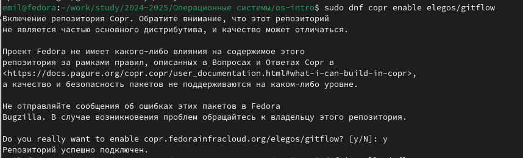
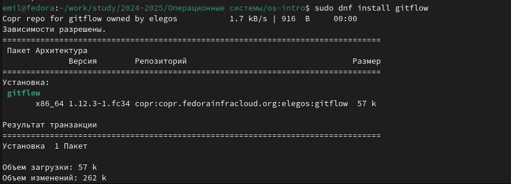
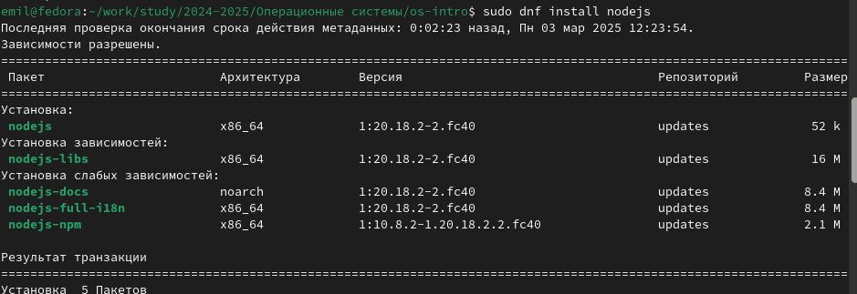
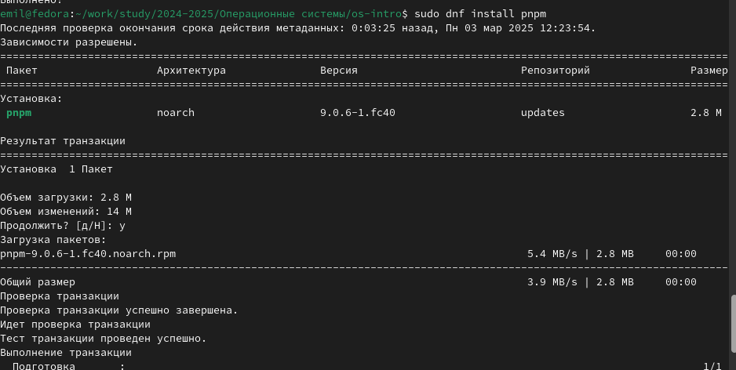

---
## Front matter
lang: ru-RU
title: Лабораторная работа №3
subtitle: Операционные сисетмы
author:
  - Ахатов Э. Э.
institute:
  - Российский университет дружбы народов, Москва, Россия
  - Объединённый институт ядерных исследований, Дубна, Россия
date: 01 января 1970

## i18n babel
babel-lang: russian
babel-otherlangs: english

## Formatting pdf
toc: false
toc-title: Содержание
slide_level: 2
aspectratio: 169
section-titles: true
theme: metropolis
header-includes:
 - \metroset{progressbar=frametitle,sectionpage=progressbar,numbering=fraction}
---

## Цель работы

Научиться оформлять отчёты с помощью легковесного языка разметки Markdown

## Задание

Сделайте отчёт по предыдущей лабораторной работе в формате Markdown.
В качестве отчёта просьба предоставить отчёты в 3 форматах: pdf, docx и md (в архиве,
поскольку он должен содержать скриншоты, Makefile и т.д.)

## Открытие шаблона

открываю шаблон

{ #fig:001 width=70% }

## Заполнение отчета

Заполняю цель работы и задание

{ #fig:002 width=70% }

## Заполнение отчета

Заполняю основную часть вставляя скриншоты

{ #fig:003 width=70% }

## Создание

создаю из мд файла докс и пдф

{ #fig:004 width=70% }

## Выводы

Научился оформлять отчёты с помощью легковесного языка разметки Markdown
