---
## Front matter
lang: ru-RU
title: Лабораторная работа №4
subtitle: Операционные сисетмы
author:
  - Ахатов Э. Э.
institute:
  - Российский университет дружбы народов, Москва, Россия
  - Объединённый институт ядерных исследований, Дубна, Россия
date: 01 января 1970

## i18n babel
babel-lang: russian
babel-otherlangs: english

## Formatting pdf
toc: false
toc-title: Содержание
slide_level: 2
aspectratio: 169
section-titles: true
theme: metropolis
header-includes:
 - \metroset{progressbar=frametitle,sectionpage=progressbar,numbering=fraction}
---

## Цель работы

Получение навыков правильной работы с репозиториями git.

## Задание

Выполнить работу для тестового репозитория.
Преобразовать рабочий репозиторий в репозиторий с git-flow и conventional commits.

## Устанавливаю из коллекции репозиториев

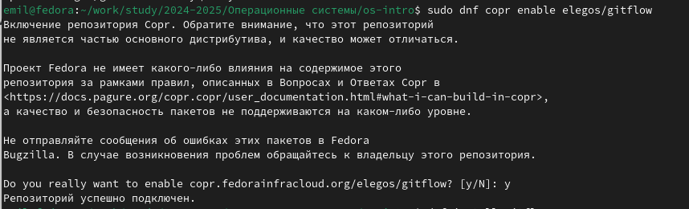{ #fig:001 width=70% }

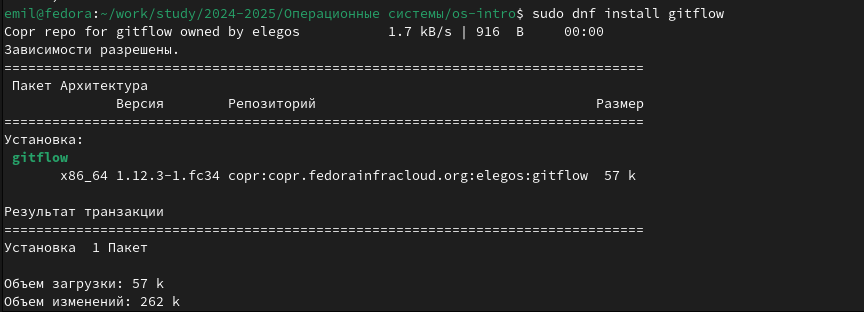{ #fig:002 width=70% }

## Устанавливаю Node.js

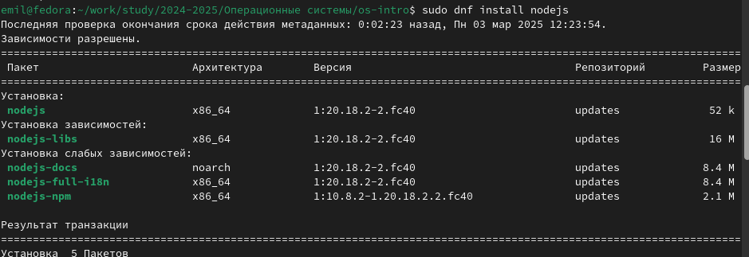{ #fig:003 width=70% }

## Устанавливаю Node.js

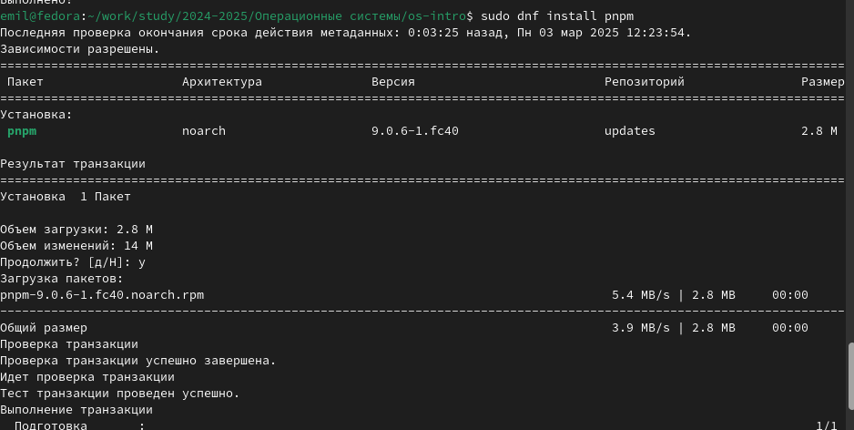{ #fig:004 width=70% }

## Запускаю и перелогиниваюсь

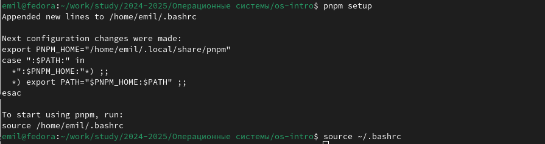{ #fig:005 width=70% }

## Прописываю pnpm init

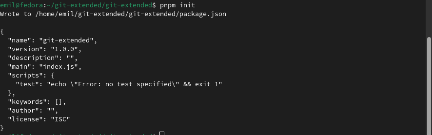{ #fig:006 width=70% }

## изменяю файл

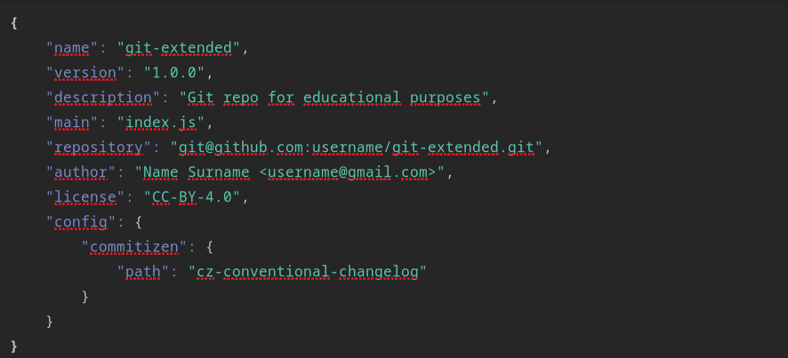{ #fig:007 width=70% }

## Проверяю в какой я ветке

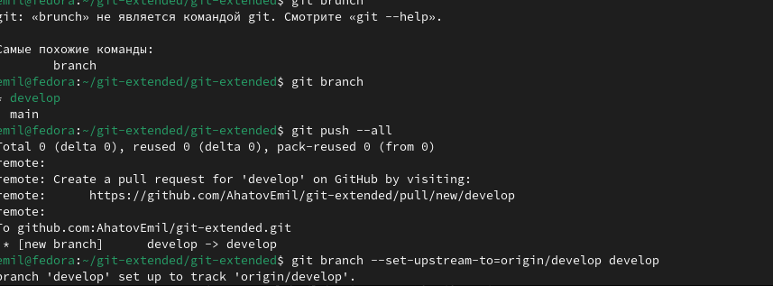{ #fig:011 width=70% }

## обновляю пакет

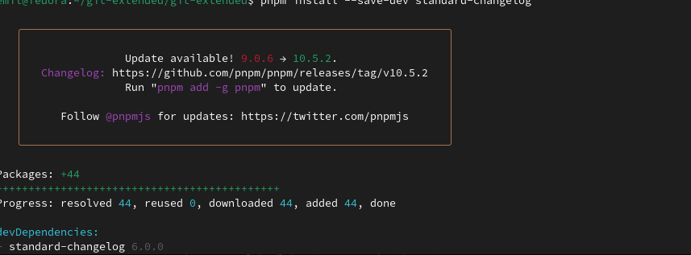{ #fig:012 width=70% }

## создаю релиз

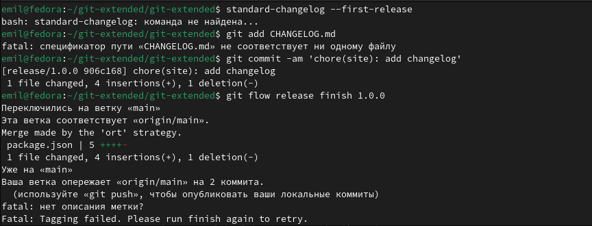{ #fig:013 width=70% }

## создаю журнал изменений добавляю его в индекс и заливаю ветку отправляю данные

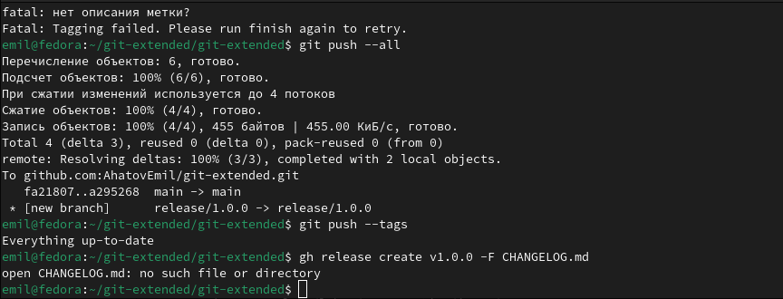{ #fig:014 width=70% }

далее я сделал все тоже самое для основного репозитория

## Выводы

я получил навыки правильной работы с репозиториями git.

