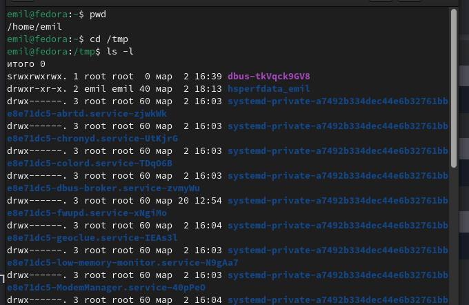
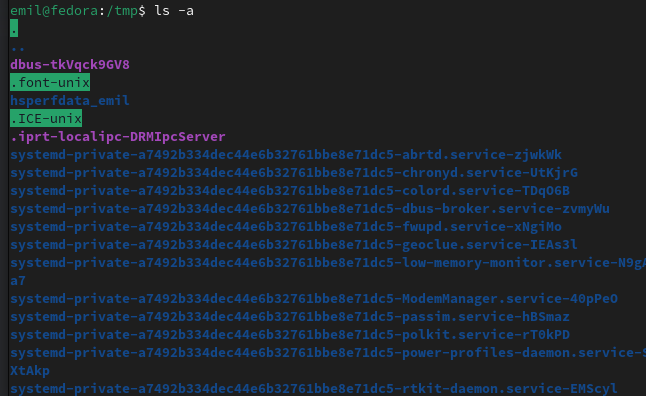
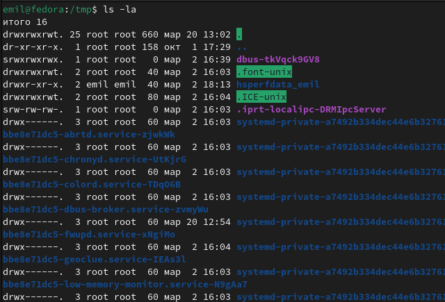
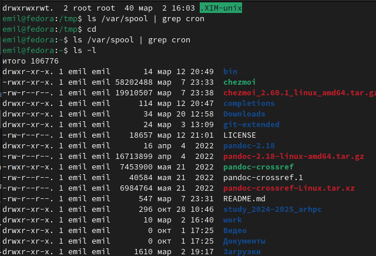
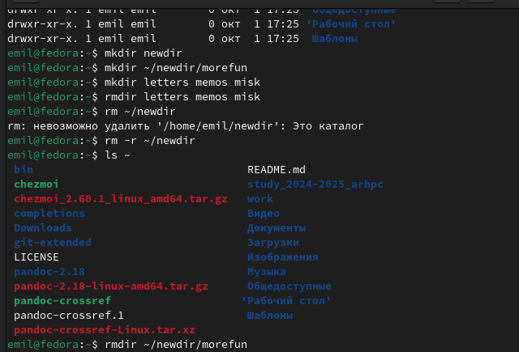
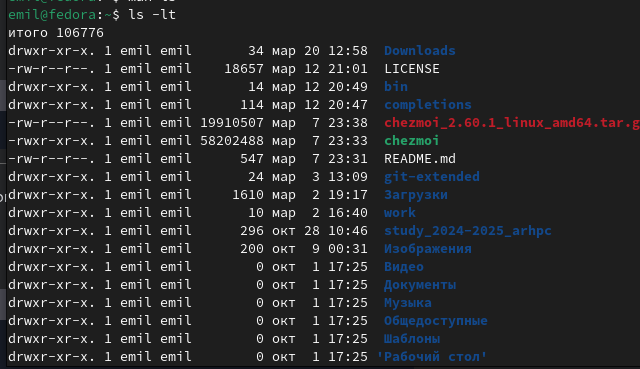
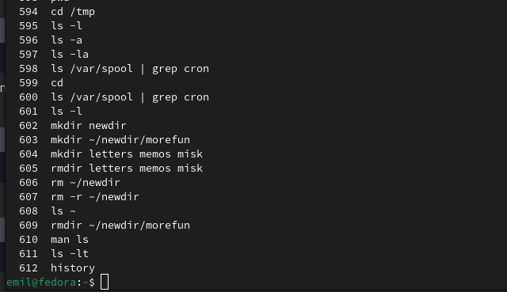

---
## Front matter
lang: ru-RU
title: Лабораторная работа №6
subtitle: Операционные сисетмы
author:
  - Ахатов Э. Э.
institute:
  - Российский университет дружбы народов, Москва, Россия
  - Объединённый институт ядерных исследований, Дубна, Россия
date: 01 января 1970

## i18n babel
babel-lang: russian
babel-otherlangs: english

## Formatting pdf
toc: false
toc-title: Содержание
slide_level: 2
aspectratio: 169
section-titles: true
theme: metropolis
header-includes:
 - \metroset{progressbar=frametitle,sectionpage=progressbar,numbering=fraction}
---

## Цель работы

Познакомиться с файловой системой Linux, изучить основные команды для работы с каталогами и файлами, а также освоить использование команды `man` для получения справочной информации.

## Задание

1. Определить полное имя домашнего каталога.
2. Выполнить действия с каталогами:
   - Перейти в каталог `/tmp`.
   - Вывести содержимое каталога `/tmp` с использованием команды `ls` и различных опций.
   - Проверить наличие подкаталога `cron` в каталоге `/var/spool`.
   - Перейти в домашний каталог и вывести его содержимое, определить владельцев файлов и подкаталогов.
3. Создать и удалить каталоги:
   - Создать каталог `newdir` и вложенный каталог `morefun`.
   - Создать три каталога (`letters`, `memos`, `misk`) одной командой и удалить их.
   - Попробовать удалить каталог `newdir` с помощью команды `rm`.
   - Удалить каталог `morefun`.
4. Использовать команду `man` для изучения опций команды `ls`.
5. Изучить команды `cd`, `pwd`, `mkdir`, `rmdir`, `rm` с помощью `man`.
6. Использовать команду `history` для модификации и выполнения команд из буфера.

## Для определения полного имени домашнего каталога использовалась команда:pwd 

{ #fig:001 width=70% }

{ #fig:002 width=70% }

## Переход в домашний каталог и вывод его содержимого

{ #fig:002 width=70% }

{ #fig:003 width=70% }

{ #fig:004 width=70% }

{ #fig:005 width=70% }

## Каталог успешно удалён.Использование команды man для изучения опций команды ls

{ #fig:006 width=70% }

{ #fig:007 width=70% }

{ #fig:008 width=70% }

## Вывод 

В ходе выполнения лабораторной работы были изучены основные команды для работы с файловой системой Linux, такие как cd, ls, mkdir, rmdir, rm. Освоены возможности команды ls с различными опциями для вывода содержимого каталогов, а также команда man для получения справочной информации о других командах. Были выполнены практические задания по созданию, удалению и управлению каталогами, а также изучены способы работы с историей команд с помощью команды history. Полученные навыки позволяют эффективно управлять файлами и каталогами в Linux, а также использовать справочную систему для изучения новых команд и их опций.

