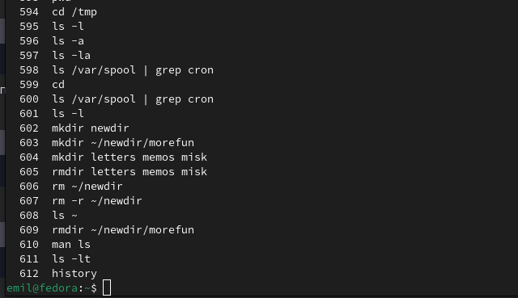

---
## Front matter
title: "Отчет по лабораторной работе №6 "
subtitle: "Дисциплина архитектура компьютера"
author: "Ахатов Эмиль Эрнстович"

## Generic otions
lang: ru-RU
toc-title: "Содержание"

## Bibliography
bibliography: bib/cite.bib
csl: pandoc/csl/gost-r-7-0-5-2008-numeric.csl

## Pdf output format
toc: true # Table of contents
toc-depth: 2
lof: true # List of figures
fontsize: 12pt
linestretch: 1.5
papersize: a4
documentclass: scrreprt
## I18n polyglossia
polyglossia-lang:
  name: russian
  options:
	- spelling=modern
	- babelshorthands=true
polyglossia-otherlangs:
  name: english
## I18n babel
babel-lang: russian
babel-otherlangs: english
## Fonts
mainfont: IBM Plex Serif
romanfont: IBM Plex Serif
sansfont: IBM Plex Sans
monofont: IBM Plex Mono
mathfont: STIX Two Math
mainfontoptions: Ligatures=Common,Ligatures=TeX,Scale=0.94
romanfontoptions: Ligatures=Common,Ligatures=TeX,Scale=0.94
sansfontoptions: Ligatures=Common,Ligatures=TeX,Scale=MatchLowercase,Scale=0.94
monofontoptions: Scale=MatchLowercase,Scale=0.94,FakeStretch=0.9
mathfontoptions:
## Biblatex
biblatex: true
biblio-style: "gost-numeric"
biblatexoptions:
  - parentracker=true
  - backend=biber
  - hyperref=auto
  - language=auto
  - autolang=other*
  - citestyle=gost-numeric
## Pandoc-crossref LaTeX customization
figureTitle: "Рис."
tableTitle: "Таблица"
listingTitle: "Листинг"
lofTitle: "Список иллюстраций"
lolTitle: "Листинги"
## Misc options
indent: true
header-includes:
  - \usepackage{indentfirst}
  - \usepackage{float} # keep figures where there are in the text
  - \floatplacement{figure}{H} # keep figures where there are in the text
---

# Цель работы

Познакомиться с файловой системой Linux, изучить основные команды для работы с каталогами и файлами, а также освоить использование команды `man` для получения справочной информации.

# Задание

1. Определить полное имя домашнего каталога.
2. Выполнить действия с каталогами:
   - Перейти в каталог `/tmp`.
   - Вывести содержимое каталога `/tmp` с использованием команды `ls` и различных опций.
   - Проверить наличие подкаталога `cron` в каталоге `/var/spool`.
   - Перейти в домашний каталог и вывести его содержимое, определить владельцев файлов и подкаталогов.
3. Создать и удалить каталоги:
   - Создать каталог `newdir` и вложенный каталог `morefun`.
   - Создать три каталога (`letters`, `memos`, `misk`) одной командой и удалить их.
   - Попробовать удалить каталог `newdir` с помощью команды `rm`.
   - Удалить каталог `morefun`.
4. Использовать команду `man` для изучения опций команды `ls`.
5. Изучить команды `cd`, `pwd`, `mkdir`, `rmdir`, `rm` с помощью `man`.
6. Использовать команду `history` для модификации и выполнения команд из буфера.

# Теоретическое введение

Файловая система Linux организована в виде дерева каталогов, начиная с корневого каталога `/`. Каждый каталог может содержать файлы и другие каталоги. Команды для работы с файловой системой позволяют создавать, удалять, перемещать и просматривать файлы и каталоги. Команда `man` предоставляет справочную информацию о других командах и их опциях.

# Выполнение лабораторной работы

Для определения полного имени домашнего каталога использовалась команда:pwd

{ #fig:001 width=70% }

Переход в каталог /tmp

Использована команда:
bash
Copy
cd /tmp

Вывод содержимого каталога /tmp

Использованы команды:

    ls — простой вывод.

    ls -l — подробный вывод.

    ls -a — вывод с включением скрытых файлов.

    ls -la — комбинированный вывод.

2.3. Проверка наличия подкаталога cron в /var/spool

Использована команда:
bash
Copy

ls /var/spool | grep cron

Подкаталог cron найден.
2.4. Переход в домашний каталог и вывод его содержимого

Использованы команды:
bash
Copy

cd ~
ls -l

Определены владельцы файлов и подкаталогов.

{ #fig:002 width=70% }

{ #fig:003 width=70% }

{ #fig:004 width=70% }

{ #fig:005 width=70% }

Создание и удаление каталогов letters, memos, misk
Использованы команды:

mkdir letters memos misk
rmdir letters memos misk

Попытка удаления каталога newdir командой rm

Использована команда:
rm -r ~/newdir

Каталог успешно удалён.
Удаление каталога morefun

Использована команда:

rmdir ~/newdir/morefun

Каталог успешно удалён.
Использование команды man для изучения опций команды ls

Использована команда:
bash
Copy

man ls

Найдена опция -R для рекурсивного вывода содержимого каталогов.
Изучение команд cd, pwd, mkdir, rmdir, rm

Использованы команды:

man cd
man pwd
man mkdir
man rmdir
man rm

{ #fig:006 width=70% }

{ #fig:007 width=70% }

{ #fig:008 width=70% }

# Вывод 

В ходе выполнения лабораторной работы были изучены основные команды для работы с файловой системой Linux, такие как cd, ls, mkdir, rmdir, rm. Освоены возможности команды ls с различными опциями для вывода содержимого каталогов, а также команда man для получения справочной информации о других командах. Были выполнены практические задания по созданию, удалению и управлению каталогами, а также изучены способы работы с историей команд с помощью команды history. Полученные навыки позволяют эффективно управлять файлами и каталогами в Linux, а также использовать справочную систему для изучения новых команд и их опций.
