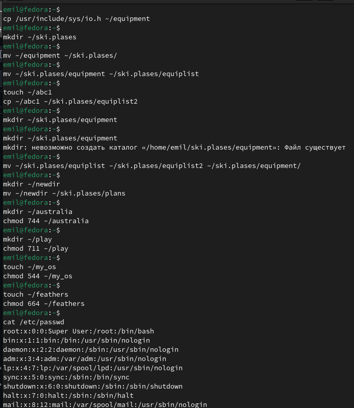

---
## Front matter
title: "Отчет по лабораторной работе №7 "
subtitle: "Дисциплина архитектура компьютера"
author: "Ахатов Эмиль Эрнстович"

## Generic otions
lang: ru-RU
toc-title: "Содержание"

## Bibliography
bibliography: bib/cite.bib
csl: pandoc/csl/gost-r-7-0-5-2008-numeric.csl

## Pdf output format
toc: true # Table of contents
toc-depth: 2
lof: true # List of figures
fontsize: 12pt
linestretch: 1.5
papersize: a4
documentclass: scrreprt
## I18n polyglossia
polyglossia-lang:
  name: russian
  options:
	- spelling=modern
	- babelshorthands=true
polyglossia-otherlangs:
  name: english
## I18n babel
babel-lang: russian
babel-otherlangs: english
## Fonts
mainfont: IBM Plex Serif
romanfont: IBM Plex Serif
sansfont: IBM Plex Sans
monofont: IBM Plex Mono
mathfont: STIX Two Math
mainfontoptions: Ligatures=Common,Ligatures=TeX,Scale=0.94
romanfontoptions: Ligatures=Common,Ligatures=TeX,Scale=0.94
sansfontoptions: Ligatures=Common,Ligatures=TeX,Scale=MatchLowercase,Scale=0.94
monofontoptions: Scale=MatchLowercase,Scale=0.94,FakeStretch=0.9
mathfontoptions:
## Biblatex
biblatex: true
biblio-style: "gost-numeric"
biblatexoptions:
  - parentracker=true
  - backend=biber
  - hyperref=auto
  - language=auto
  - autolang=other*
  - citestyle=gost-numeric
## Pandoc-crossref LaTeX customization
figureTitle: "Рис."
tableTitle: "Таблица"
listingTitle: "Листинг"
lofTitle: "Список иллюстраций"
lolTitle: "Листинги"
## Misc options
indent: true
header-includes:
  - \usepackage{indentfirst}
  - \usepackage{float} # keep figures where there are in the text
  - \floatplacement{figure}{H} # keep figures where there are in the text
---

# Цель работы

Ознакомление с файловой системой Linux, работа с файлами и каталогами, управление правами доступа.

# Задание

1. Определить полное имя домашнего каталога.
2. Выполнить действия с каталогами:
   - Перейти в каталог `/tmp`.
   - Вывести содержимое каталога `/tmp` с использованием команды `ls` и различных опций.
   - Проверить наличие подкаталога `cron` в каталоге `/var/spool`.
   - Перейти в домашний каталог и вывести его содержимое, определить владельцев файлов и подкаталогов.
3. Создать и удалить каталоги:
   - Создать каталог `newdir` и вложенный каталог `morefun`.
   - Создать три каталога (`letters`, `memos`, `misk`) одной командой и удалить их.
   - Попробовать удалить каталог `newdir` с помощью команды `rm`.
   - Удалить каталог `morefun`.
4. Использовать команду `man` для изучения опций команды `ls`.
5. Изучить команды `cd`, `pwd`, `mkdir`, `rmdir`, `rm` с помощью `man`.
6. Использовать команду `history` для модификации и выполнения команд из буфера.

# Выполнение лабораторной работы

Копирование файла из /usr/include/sys/ в домашний каталог Создание каталога ski.plases Перемещение файла equipment в ski.plases Переименование файла equipment в equiplist
Создание файла abc1 и его копирование Создание каталога equipment внутри ski.plases Перемещение файлов equiplist и equiplist2 в equipment
Создание и перемещение каталога newdir в plans
Права drwxr--r-- для каталога australia Права drwx--x--x для каталога play Права -r-xr--r-- для файла my_os Права -rw-rw-r-- для файла feathers
Просмотр /etc/passwd
Копирование feathers в file.old Перемещение file.old в play Копирование каталога play в fun Перемещение fun в play с переименованием в games
Запрет чтения для владельца feathers Попытка просмотра feathers через cat Попытка копирования feathers Возврат права на чтение владельцу
Запрет выполнения для каталога play Попытка перехода в play Возврат права на выполнение
Анализ команд (man) 5.1. mount
Назначение: Монтирование файловых систем. Пример: mount /dev/sda1 /mnt
5.2. fsck
Назначение: Проверка и восстановление файловой системы. Пример: fsck /dev/sda1
5.3. mkfs
Назначение: Создание файловой системы. Пример: mkfs.ext4 /dev/sdb1
5.4. kill

{ #fig:001 width=70% }

Назначение: Отправка сигналов процессам. Пример: kill -9 1234

# Выводы

В ходе работы освоены основные команды Linux для работы с файлами, каталогами и правами доступа.
