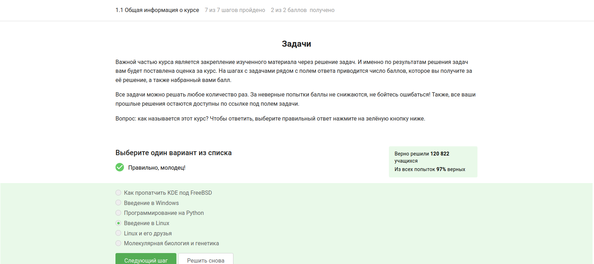
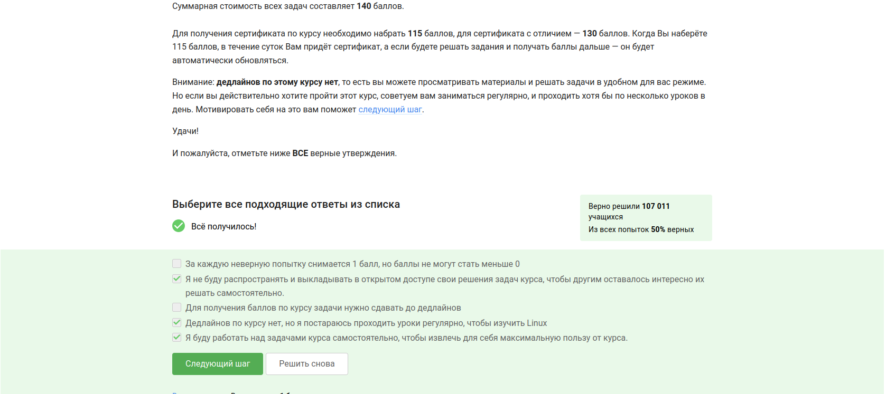
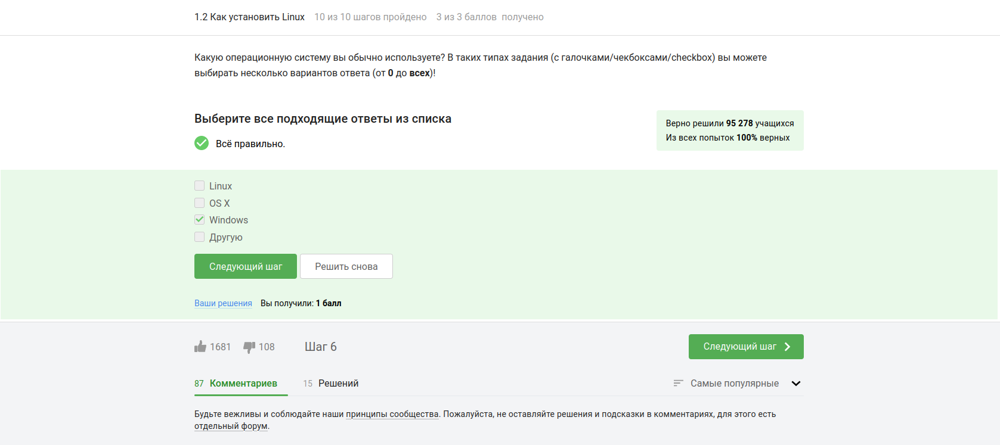
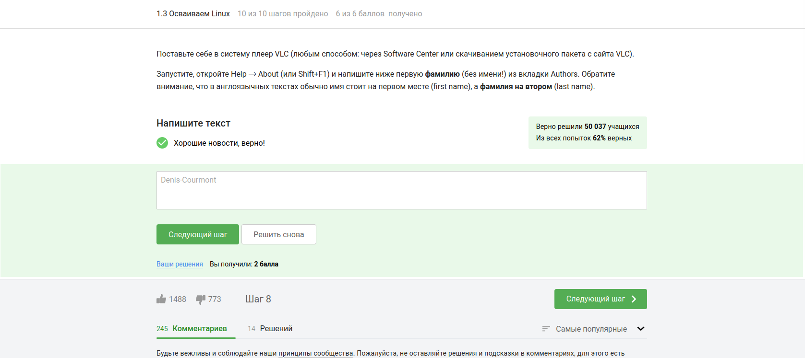
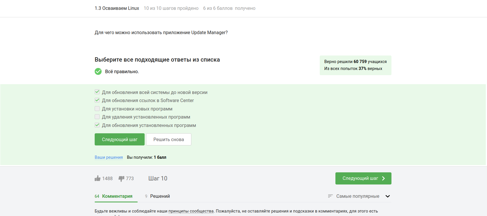
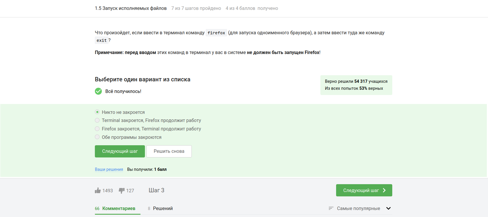
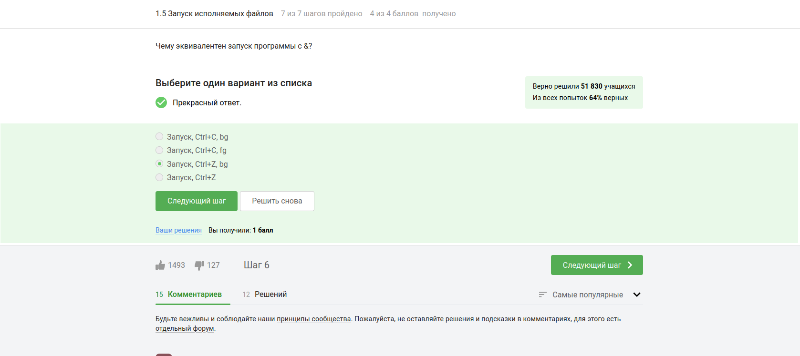
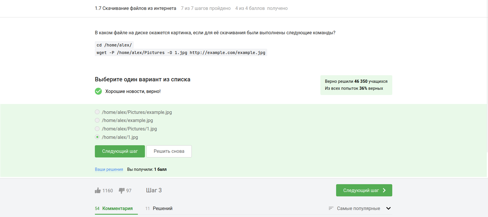
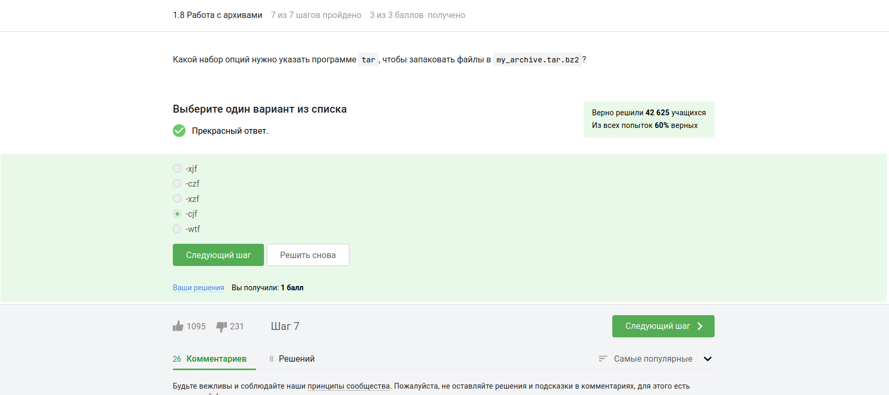

---
## Front matter
lang: ru-RU
title: Отчет о прохождении 1 этапа внешних курсов
subtitle: Операционные сисетмы
author:
  - Ахатов Э. Э.
institute:
  - Российский университет дружбы народов, Москва, Россия
  - Объединённый институт ядерных исследований, Дубна, Россия
date: 01 января 1970

## i18n babel
babel-lang: russian
babel-otherlangs: english

## Formatting pdf
toc: false
toc-title: Содержание
slide_level: 2
aspectratio: 169
section-titles: true
theme: metropolis
header-includes:
 - \metroset{progressbar=frametitle,sectionpage=progressbar,numbering=fraction}
---
## Цель работы

Ознакомиться с функционалом операционной системы Linux.

## Задание

Просмотреть видео и на основе полученной информации пройти тестовые задания.

## Теоретическое введение

Линукс - в части случаев GNU/Linux — семейство Unix-подобных операционных систем на базе ядра Linux, включающих тот или иной набор утилит и программ проекта GNU, и, возможно, другие компоненты. Как и ядро Linux, системы на его основе, как правило, создаются и распространяются в соответствии с моделью разработки свободного и открытого программного обеспечения. Linux-системы распространяются в основном бесплатно в виде различных дистрибутивов — в форме, готовой для установки и удобной для сопровождения и обновлений, — и имеющих свой набор системных и прикладных компонентов, как свободных, так и проприетарных. 

## Выполнение лабораторной работы

{#fig:001 width=70%}

## Курс действительно называется "Введение в Linux", поэтому с этим вопросом проблем не возникло.

{#fig:002 width=70%}

## Прочитав критерии прохождения курса, я отметил необходимые утверждения.

{#fig:003 width=70%}

## Стандартная операционная система, предлагаемая большей частью магазинов - windows, именно она стоит у меня на основном компьютере.

{#fig:004 width=70%}

## На свой компьютер мы устанавливали специальную программу VirtualBox, которая нужна для подключения одной операционной на другой.

{#fig:005 width=70%}

## Да, моя виртуальная машина хорошо работает, и у меня получилось запустить с неё Линукс, но в последнее время я чаще использую ноутбук, на котором Линукс стоит как основная операционная система.

{#fig:006 width=70%}

## Я создал документ, и перед сохранением выбрал нужный формат, а после я его прикрепил к курсу. Прикрепленный файл видно на скриншоте.

{#fig:007 width=70%}

## deb — формат пакетов операционных систем проекта Debian. Используется также их производными, такими как Ubuntu, Knoppix и другими.

{#fig:008 width=70%}

## Здесь на скриншоте видно, что установив программу медиапроигрывателя я посмотрел, кто авторы программы и записала первую фамилию.

{#fig:009 width=70%}

## Менеджер обновлений — это программа для обновления установленного программного обеспечения в дистрибутивах ОС Linux, основанных на Debian или использующих систему управления пакетами APT. Менеджер обновлений устанавливает обновления безопасности или просто улучшающие функциональность программы.

{#fig:010 width=70%}

## Ассоль - героиня литературного произведения, а термин - это определение.

{#fig:011 width=70%}

## Интерфейс командной строки Linux является регистрозависимым.

{#fig:012 width=70%}

## Интерфейс командной строки Linux является регистрозависимым, поэтому не подходит вариант, где буква А - маленькая(строчная).

{#fig:013 width=70%}

## Я прописываю полный путь до директории Downloads, так как на данный момент нахожусь в другой директории.

{#fig:014 width=70%}

## rm -r удаление директории и рекуррентное удаление файлов, находящихся в ней.

{#fig:015 width=70%}

## Это я проверил эмпирическим путём, что видно в ходе скринкаста.

{#fig:016 width=70%}

## Это запуск программы в фоновом режиме.

{#fig:017 width=70%}

{#fig:018 width=70%}

## Автоматически поток ошибок выводится на экран - это видно, например, в ходе выполненных лабораторных. В файл будет поток выводиться, если его перенаправить.

{#fig:019 width=70%}

{#fig:020 width=70%}

## 1. cat names.txt | ./interacter.py | less = вывод на экран 2. cat names.txt | ./interacter.py 2>err.txt | less = вывод ошибки в err.txt

{#fig:021 width=70%}

## Команда wget -P /home/alex/Pictures http://example.com/example.jpg  скачивает файл и даже размещает его, назвав example.jpg, в папке /home/alex/Pictures. Но после этих манипуляций срабатывает часть ключа -O 1.jpg и только что скачаный example.jpg конвертируется в 1.jpg и размещается в текущей директории, в которой мы находимся, потому что путь файла уже не указан, указано только название - 1.jpg.

{#fig:022 width=70%}

{#fig:023 width=70%}

## Типы файлов При загрузке материалов из Интернета вы часто захотите ограничить поиск только определенными типами файлов. Например, если вы заинтересованы в загрузке GIF-файлов, вы не будете рады получить кучу документов PostScript, и наоборот.Wget предлагает две опции для решения этой проблемы. В описании каждой опции перечислены краткое имя, длинное имя и эквивалентная команда в .wgetrc.

## Аргумент опции '--accept' представляет собой список суффиксов или шаблонов файлов, которые Wget будет загружать при рекурсивном получении. Суффикс - это конечная часть файла, состоящая из "обычных" букв, например, 'gif' или '.jpg'. Шаблон совпадения содержит подстановочные знаки типа shell, например, 'books*'.

## Таким образом, указав 'wget -A gif,jpg', Wget загрузит только файлы, заканчивающиеся на 'gif' или 'jpg', то есть GIF и JPEG. С другой стороны, 'wget -A "zelazny*196[0-9]*" загрузит только файлы, начинающиеся с 'zelazny' и содержащие в себе числа от 1960 до 1969. Описание того, как работает сопоставление шаблонов, можно найти в руководстве к вашей оболочке.

{#fig:024 width=70%}

{#fig:025 width=70%}

## gzip (сокращение от GNU Zip) — утилита сжатия и восстановления (декомпрессии) файлов, использующая алгоритм Deflate.

{#fig:026 width=70%}

## c - архиваторj - указатель на тип архиватора bzip f - потому что создаем архив в файловой системе

{#fig:027 width=70%}

## `?` = один символ `alexey` = маленькая буква И файл должен быть `jpeg`, а не `jpg`

{#fig:028 width=70%}

## Регистр - маленькая буква, слово - `world`, а не `word`

{#fig:029 width=70%}

## Выводы

Я просмотрел курс и освежил в памяти навыки работы с архивами, скачивание файлов, команды grep и тп.

